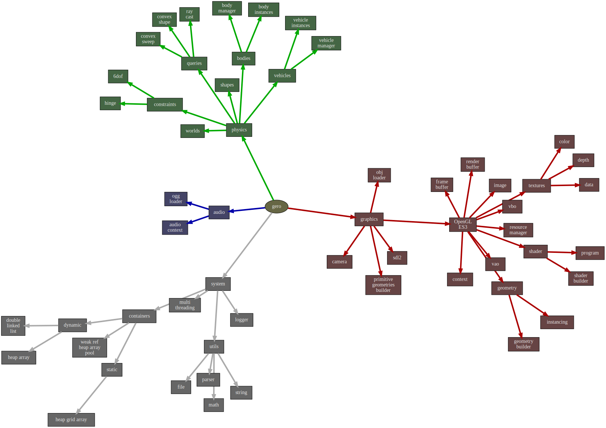
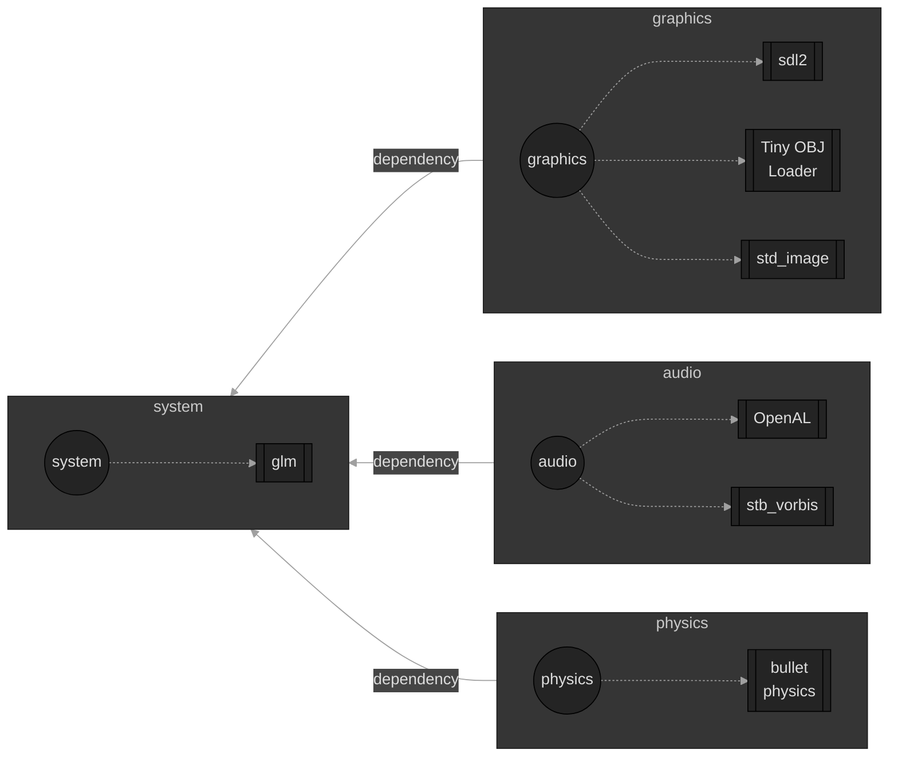

# Geronimo

## Table of Contents
- [Geronimo](#geronimo)
  - [Table of Contents](#table-of-contents)
- [Online Demo Link](#online-demo-link)
  - [Diagrams](#diagrams)
- [Dependencies](#dependencies)
  - [Dependency: Emscripten 3.1.44 (for web-wasm build)](#dependency-emscripten-3144-for-web-wasm-build)
  - [Dependency: SDL2 (for native build)](#dependency-sdl2-for-native-build)
  - [Dependency: bullet3, glm, tinyobjloader, stb](#dependency-bullet3-glm-tinyobjloader-stb)
- [How to Build (Quick)](#how-to-build-quick)
  - [Build Everything (will skip web-wasm if emscripten is absent)](#build-everything-will-skip-web-wasm-if-emscripten-is-absent)
- [How to Build (Detailed)](#how-to-build-detailed)
- [Project(s) using it](#projects-using-it)
- [Thanks for watching!](#thanks-for-watching)


# Online Demo Link

**`/!\ important /!\`**

https://guillaumebouchetepitech.github.io/geronimo/samples/test-bed/dist/index.html

**`/!\ important /!\`**

## Diagrams







# Dependencies

## Dependency: Emscripten 3.1.44 (for web-wasm build)
```bash
git clone https://github.com/emscripten-core/emsdk.git

cd emsdk

./emsdk install 3.1.44
./emsdk activate --embedded 3.1.44

. ./emsdk_env.sh

em++ --clear-cache
```

## Dependency: SDL2 (for native build)
```
libsdl2-dev
```

## Dependency: bullet3, glm, tinyobjloader, stb

The dependencies will be downloaded and built with the `Build Everything` method below

# How to Build (Quick)

## Build Everything (will skip web-wasm if emscripten is absent)

```bash
chmod u+x ./sh_everything.sh
./sh_everything.sh
# will tell if a dependency is missing
# will skip the web-wasm build if emscripten is not detected
```

# How to Build (Detailed)

[Specific Doc](./detailed-build.md)

# Project(s) using it

- Self Learning 3d Cars [Github Link](https://github.com/GuillaumeBouchetEpitech/self-learning-3d-cars)
- Basic Genetic Algorithm [Github Link](https://github.com/GuillaumeBouchetEpitech/basic-genetic-algorithm)

# Thanks for watching!
